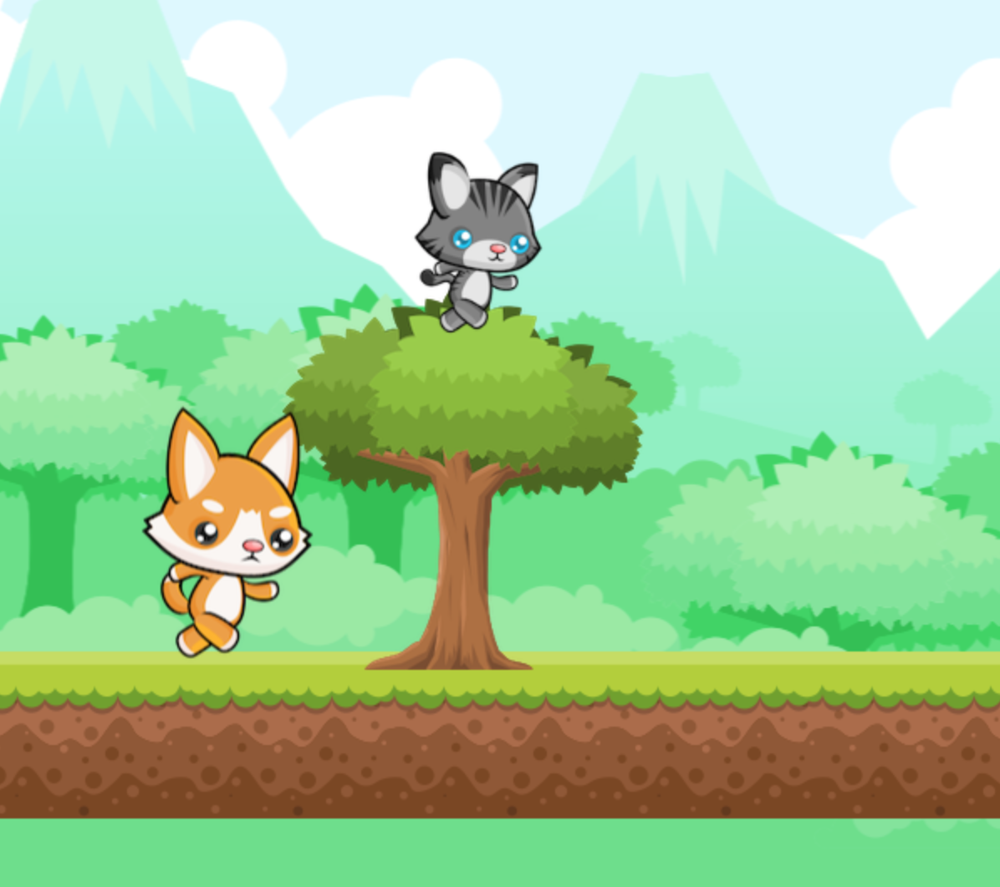

# README

# Kitty-Escape

[Kitty Escape Live](https://fiona4life19.github.io/Kitty-Escape/)

Kitty Escape is a Javascript web-based game that features PixiJs as the graphics engine. The theme of the game is an infinite runner in which the player must jump to avoid obstacles

# Features and Implementation 

## Animations

Kitty Escape features two character each with their own animations that give the illusion that they are moving against the scrolling background. 

 

## Gravity

Kitty Escape implements a system of gravity and collision to test the users timing in jumping over the tree and crate obstacles.

 
